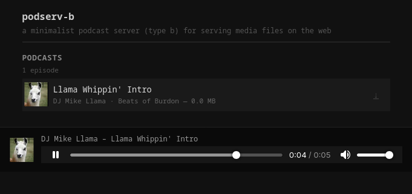

# podserv-b

[](https://github.com/l5yth/podserv-b/actions/workflows/rust.yml)
[](https://codecov.io/gh/l5yth/podserv-b)
[](https://github.com/l5yth/podserv-b/releases)
[](https://crates.io/crates/podserv-b)
[](https://github.com/l5yth/podserv-b)
[](https://github.com/l5yth/podserv-b/blob/main/LICENSE)

_a minimalist podcast server (type b) for serving media files on the web._



scans a provided directory of mp3 files, reads their id3 tags, and serves a
minimalist-themed single-page web page with an embedded audio player, album
art, and download links. supports flat and nested media directories.

## installation

```sh
cargo install podserv-b
```

for linux packages see [archlinux/PKGBUILD](./packaging/archlinux/PKGBUILD)
or
[gentoo/podserv-b-9999.ebuild](./packaging/gentoo/media-sound/podserv-b/podserv-b-9999.ebuild)

## usage

`podserv-b` binds to `127.0.0.1:3000` and serves mp3 files in `./media` by default

```sh
podserv-b v0.1.1
a minimalist podcast server (type b) for serving media files on the web
apache v2 (c) 2026 l5yth

Command-line arguments

Usage: podserv-b [OPTIONS]

Options:
  -c, --config <CONFIG>  Path to the TOML configuration file [env: CONFIG=] [default: /etc/podserv-b.toml]
  -m, --media <MEDIA>    Directory containing MP3 files to serve [env: MEDIA_DIR=] [default: media]
  -b, --bind <BIND>      Address to bind the HTTP server to [env: BIND=] [default: 127.0.0.1:3000]
  -h, --help             Print help
  -V, --version          Print version
```

### configuration

the config file is a TOML file read at startup. pass its path with `-c` / `--config`
(or the `CONFIG` env var). the default path is `/etc/podserv-b.toml`.

```toml
title       = "My Podserv B"
description = "Station for Podcast Lovers, Listeners, and Dogs"
website     = "https://example-b.com"
```

all fields are optional; defaults are used when the file is absent.

### running as a service

a systemd unit is provided in [`packaging/systemd/podserv-b.service`](./packaging/systemd/podserv-b.service).
it runs as a dedicated `podserv-b` system user and expects:

| path | purpose |
|------|---------|
| `/etc/podserv-b.toml` | site config (title, description, website) |
| `/srv/podcasts` | media directory — drop mp3s here |

```sh
# create user and media directory (distro packages do this automatically)
useradd --system --home /srv/podcasts --shell /sbin/nologin podserv-b
mkdir -p /srv/podcasts && chown podserv-b:podserv-b /srv/podcasts

# install and start
install -Dm644 packaging/systemd/podserv-b.service /usr/lib/systemd/system/
systemctl enable --now podserv-b
```
